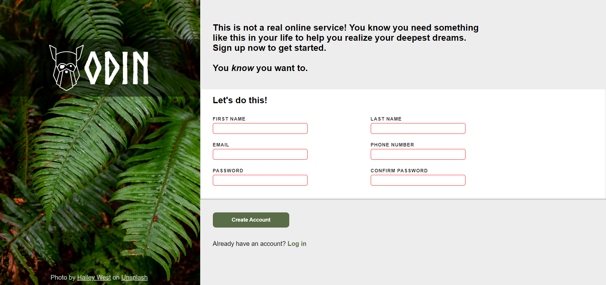

# Sign-up Form

A simple front-end signup form built as part of **The Odin Project** curriculum. This project focuses on creating a well-styled form with appropriate HTML5 validation, but without any backend or JavaScript functionality.

## Reference Design vs Achieved Design

- Reference

- Achieved

## Features

- A structured sign-up form using semantic HTML.
- CSS styling for a clean and user-friendly design.
- Basic form validation using HTML5 attributes.
- Proper accessibility features for improved usability.

## Technologies Used

- **HTML5**: For structuring the form elements.
- **CSS3**: For styling and layout design.

## Future Improvements

- Adding JavaScript to check for password confirmation.
- Implementing a backend to handle user data.
- Enhancing JavaScript validation to trigger the `:invalid` pseudo-class only after the user attempts to submit the form at least once.
- Improving responsiveness and overall styling for better user experience.
- Mobile and other screen sizes support.
- Adding real-time validation feedback using JavaScript.
- Enhancing UI with animations and transitions for better interaction.

## Live Demo

[GitHub Pages Link](https://linzi-v7.github.io/signup-form/)
Note: Doesnt work well with smaller screen sizes and mobile yet.

## License

This project is licensed under the MIT License.

## Contact

For any inquiries or collaborations, reach out to me via:

- **GitHub:** [linzi-v7](https://github.com/linzi-v7)
- **LinkedIn** [Click Me!](https://www.linkedin.com/in/faris-osama-7a3496303/)

---

### Project Status: 🚀 Project completed for the course, with plans to add more features in the future
